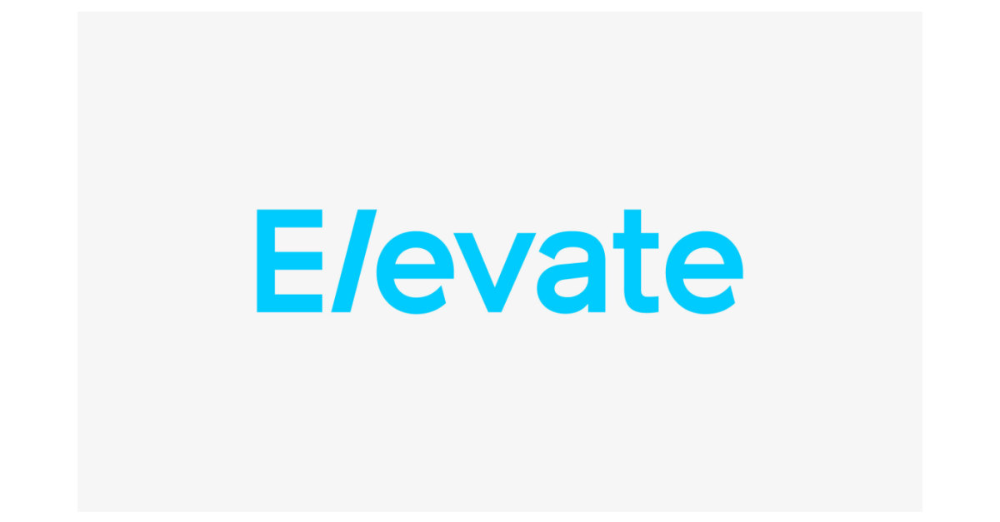

#
# FinTech Case Study

* [Overview and Origin](#overview-and-origin)

* [Business Activities](#business-activities)

* [Landscape](#landscape)

* [Results](#results)

* [Recommendations](#recommendations)

* [Resources](#resources)
#
## Overview and Origin
#

#
* The company currently operates in US as Elevate Credit, Inc. [Elevate](https://www.elevate.com/home.html).

* The company was established under its current name as a spinoff from [Think Finance, Inc.](https://en.wikipedia.org/wiki/Think_Finance) in 2014.

* Company HQ is located in Fort Worth, TX. Current address: 4150 International Plaza, Ste. 300, Forth Worth, TX 76109.

* Elevate is a publicly traded company [NYSE: ELVT](https://finance.yahoo.com/quote/ELVT/).
Current President and CEO of the company is Jason Harvison. [The list of all company executives](https://www.elevate.com/company.html).

* Elevate was founded with the idea to reinvent the non-prime lending idustry by giving a growing ["New Middle Class"](https://www.newmiddleclass.org/our-mission/#nmc) access to responsible and transparent online credit options.

* Elevate markets to its customers in US and UK the four main online credit programs: [Rise](https://www.risecredit.com/), [Elastic](https://www.elastic.com/), [Sunny(UK)](https://sunny.co.uk/) and [Today](https://www.todaycard.com/apply/findmyoffer). 

* Elevate receives debt financing for its Rise and Sunny loans from Victory Park Management, an affiliate of [Victory Park Capital](https://www.victoryparkcapital.com/). Funding for the Elastic lines of credit come from [Republic Bank](https://www.republicbank.com/home/home), a third-party lender that uses Elevate’s software.

* As of December 31, 2019, Elevate serves more than 2.4 million customers with $8.1 billion in credit. This includes originations and customers from 2002- December 31, 2019 from both current and predecessor products. 
#
## Business Activities
#
* The company targets an economic market segment that they named ["New Middle Class"](https://www.newmiddleclass.org/our-mission/#nmc). About 160 million people that fall under this group are credit-constrained Americans with credit scores below 700 and very little or no savings. They have very little credit options available and are forced to use very expensive forms of credit such as payday loans.

* According to [research](https://www.elevate.com/who-we-help.html), US non-prime credit market made about 44% of the total US credit, which was larger than prime credit market, which made about 34%. 

* Elevate recognized a big business opportunity through unmet non-prime lending needs which amounts to about $143 billion. 

* Elevate developed a sofisticated data driven risk-based pricing model called [Segment Optimized Analytics](https://www.elevate.com/products.html?hashtag-analytics) that focuses primarily on non-prime credit industry. The model analyzes sub-prime segment uzing traditional and machine learning techniques. This analysis includes credit scores, fraud scores and affordability assesment. It also performs algoritmic verifications to detect potential fraud. The company uses both cutting-edge and traditional analytical techniques and uses a vast array of data sources, while complying with applicable lending laws. As a result of their proprietary technology and risk analytics, over 90% of loan applications are fully automated with no manual review required. 
#

## Landscape
#
* Elevate is a provider of non-traditional lending solutions to non-prime customers. It competes with traditional banks, legacy sub-prime lenders and other online lenders.

* Top competitors and alternatives in the industry that Elevate thrives in are [Avant](https://www.avant.com/landing/google_ppc_branded/?utm_source=google&utm_medium=cpc&utm_campaign=GS_Brand_Avant_x_US_D_x&utm_content=358234417199&utm_term=avant&adgroupid=54137903517&utm_adgroup=Root_x_Exact&id=kwd-11657431&device=c&campaignid=1356382232&opti_ca=1356382232&opti_ag=54137903517&opti_ad=358234417199&opti_key=&opti_target=&gclid=Cj0KCQjwqfz6BRD8ARIsAIXQCf1l-EaSAUvNbExFd4ojX9Nin21JjFdOudq-qwcqVXCT0WHq9TzPAdsaAv9KEALw_wcB), [LendUp](https://www.lendup.com/), [ZestAi](https://zest.ai/) and [Earnin](https://www.earnin.com/).

* Traditional banks failed to respond appropriately to a decades-long shift in macroeconomic landscape and legacy non-prime lenders have not evolved either. There was a large customer segment out there (160 million people) left with very few but expensive solutions available to them to fill their urgent lending needs.

* [Research](https://www.elevate.com/who-we-help.html) identified that 46% of American adults said they could not cover emergency expense costing $400.00 and would be forced to borrow or sell property. Additionally, two in every five Americans experience income swings of more than 30%. Median household income in 2015 was $56,516.

#
## Results
#
* According to Elevate's [2019 Annual Report](https://s23.q4cdn.com/490591927/files/doc_financials/2020/ar/2019-annual-report.pdf) the company provided $6.6 billion in credit to approx. 1.6 million customers.

* The revenue for the year 2019 was $747 million, 5% lower compared to $786.7 million in 2018. This decrease in revenues primarily resulted from a decrease in the effective APR on the combined loans receivable - principal balance as the APR declined to 122% during the year ended December 31, 2019, from 129% during the comparable prior year period.

* The effective APR in 2019 was 122% compared to 251% in 2013. The estimate is that this reduction in APR since 2013 saved customers more than $6.5 billion over what they woud have paid to payday loans.

* Total loan loss provision for the year ended December 31, 2019 was 49% of revenues, which was within targeted range of 45% to 55%, and lower than the 52% in the prior year period. For the year ended December 31, 2019, net charge-offs as a percentage of revenues totaled 50%, compared to 52% in the prior year period. The company expects total loan loss
provision as a percentage of revenues to continue to remain within the established targeted range.

* Due to successful credit bureau reporting, more than 140,000 customers saw improvement in their credit scores.

#
## Recommendations
#

* Elevate currently provides only personal loan solutions to non-prime customers. A sucessful utilization of their proprietary data analytics methodology, combined with years of non-prime lending experience their management has, creates more opportunities in other lending segments, such as mortgage and vehicle lending.

* Developing further data analytics methodolygy and loan underwriting processes would have a goal to identify among existing customers those that would qualify for these new loan options.

* Entering the mortgage and vehicle lending industry segment would lead to diversification of their existing loan portfolio, increase in revenues, as a result of a better borrower quality as well as lower default rate. Additionally, a part of the portfolio would now be covered with real assets. 

* Elevate's core belief is that their lending solutions will ultimately have a positive impact on financial position of non-prime borrowers. It is logical then that this newly created segment of better quality existing non-prime customers be offered an affordable access to non-prime mortgage and vehicle lending options, without hidden and punitive fees.

#
## Resources
#
* https://www.elevate.com/home.html

* https://s23.q4cdn.com/490591927/files/doc_financials/2020/ar/2019-annual-report.pdf

* https://www.owler.com/company/elevate

* https://finance.yahoo.com/quote/ELVT/

* https://www.valuewalk.com/2016/01/elevate-credit-reviews/

* https://www.marketwatch.com/story/5-things-to-know-about-elevate-credit-before-the-subprime-online-lenders-ipo-2017-04-03

